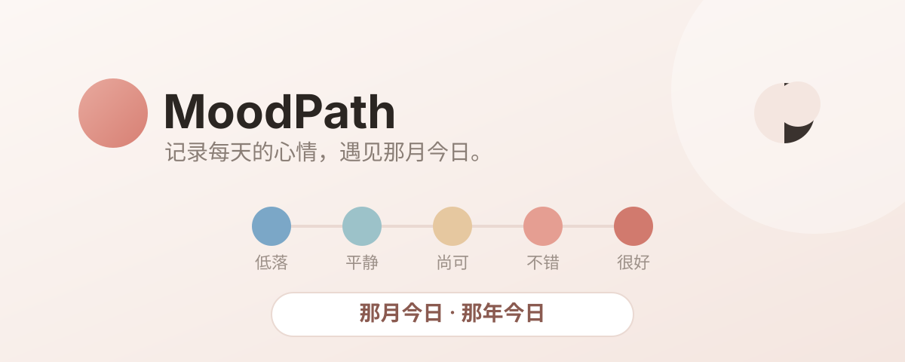

# MoodPath · 那月今日



一个**纯本地、零依赖、可加密**的情绪与感恩日记。每天用 5 档心情标尺写三件感恩的事、三件遗憾的事，并在「那月今日 / 那年今日」与自己重逢。

> 数据只存在你自己的浏览器里，没有后端、没有账号、没有追踪。把链接发给朋友，也不会串数据。

## ✨ 它是什么

MoodPath 是一个跑在浏览器里的轻量日记应用。不需要注册，打开就能用：给日记起个名字，写下今天的心情与三好三坏，剩下的交给时间。

## 🌟 为什么不一样

- **本地优先** —— 所有数据存浏览器 `localStorage`，端到端私密；每个使用者之间完全隔离。
- **可加密** —— 可选 AES-256（PBKDF2 派生密钥 + AES-GCM），给日记上一把只有你能开的锁。
- **零依赖** —— 纯 HTML / CSS / 原生 JS，无框架、无 CDN、无构建步骤，双击 `index.html` 即用。
- **那月今日 / 那年今日** —— 自动把今天与过去同月、同日的记录摆在一起，让回忆自己说话。
- **随时带走** —— 支持导出 / 导入备份文件，以及独立的恢复密钥。

## 🧭 怎么用

顶部四个标签贯穿全程：**记录 · 搜索 · 统计 · 设置**。

| 视图 | 能做什么 |
| --- | --- |
| **记录** | 5 档心情标尺 + 三件感恩 + 三件遗憾，右侧自动浮现那月今日 / 那年今日。 |
| **搜索** | 按关键词检索历史日记。 |
| **统计** | 日历热力、心情环形图、自动分词的词云。 |
| **设置** | 开启加密、导出 / 导入备份、查看恢复密钥、切换日夜模式。 |

### 本地运行

```bash
# 任意静态服务器即可
python3 -m http.server 8000
# 浏览器打开 http://localhost:8000
```

也可直接双击 `index.html` 打开（部分浏览器对本地文件有限制，建议用上面的方式）。

### 部署到 GitHub Pages

把本仓库推送到 `用户名/moodpath`，在仓库 **Settings → Pages** 开启，即可获得一个可分享的公网链接。

## 📊 统计页里有什么

- **日历热力**：一眼看见一整年的情绪密度。
- **环形图**：各心情档位的占比分布。
- **词云**：本地实时分词，提取你最常写下的关键词（中文按词典正向最大匹配，碎片自动过滤）。

## 🔒 隐私说明

- 没有服务器，因此也没有账号系统与行为追踪。
- 加密密钥由你的访问密码本地派生，任何第三方（包括本站）都看不到明文。
- 忘记密码？可用**恢复密钥**或**备份文件**找回，二者互不依赖。

## 🗂 项目结构

| 文件 | 作用 |
| --- | --- |
| `index.html` | 页面结构、开场锁屏与四个视图 |
| `css/styles.css` | 苹果风界面样式（系统字体、毛玻璃、大圆角） |
| `js/store.js` | 本地存储、加密与备份导入导出 |
| `js/charts.js` | 零依赖 SVG 图表（日历 / 环形） |
| `js/wordcloud.js` | 词云渲染 |
| `js/utils.js` | 中文分词与通用工具 |
| `js/app.js` | 应用主逻辑与交互 |

## 📜 许可

本项目供个人学习与非商业使用。如需商用或二次分发，请联系作者并获得许可。

---

用心记录，温柔以待 · MoodPath
